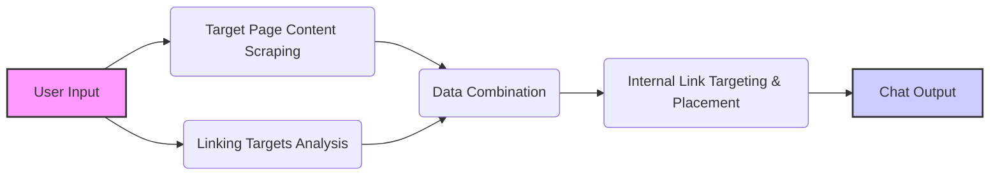

# Week 1 - Internal Link Placement Agent

## Overview

This tool is designed to help with internal link placement strategy. It leverages AI to analyze web pages, generate summaries, and identify optimal linking opportunities within your content.

**Key Features:**

- Scrapes content from a target URL and a list of URLs to link.
- Provides concise summaries of the linked URLs.
- Suggests relevant anchor text and specific link placement locations within the target URL's content.

## How It Works

This LangFlow flow is structured with an initial split into two parallel flows that converge for final processing:



1.  **User Input:** The process begins with a user providing a target URL and a list of URLs to link via the **Chat Input** node.

2.  **Flow 1: Target Page Content Scraping:** This flow focuses on extracting the main content from the target URL. It includes:

    - **Prompt (Target URL Scrape):** Formats a prompt to instruct the agent to scrape the content of the target URL.
    - **Firecrawl Scrape API Tool:** Uses the Firecrawl API to scrape the content from the target URL.
    - **Agent (Main Content Scrape Agent):** Uses an LLM to scrape the content of the target URL and output it in markdown format.

3.  **Flow 2: Linking Targets Analysis:** This flow focuses on analyzing the URLs to link and generating summaries. It includes:

    - **Prompt (Linking Targets Summarization):** Formats a prompt to instruct the agent to summarize the content of the URLs to link.
    - **Firecrawl Scrape API Tool:** Uses the Firecrawl API to scrape the content from the URLs to link.
    - **Agent (Content Summarization Agent):** Uses an LLM to generate concise summaries of the content from the URLs to link.

4.  **Data Combination:** This step combines the outputs from both flows into a single text chunk. It includes:

    - **Combine Text:** Combines the summaries of the linked URLs and the scraped content of the target URL into a single text chunk.

5.  **Internal Link Targeting & Placement:** This step analyzes the combined text to determine the best internal link placements and anchor text. It includes:

    - **Agent (Internal Link Targeting Agent):** Uses an LLM to analyze the combined text and determine the best internal link placements and anchor text.
    - **Agent (Internal Link Placement Agent):** Uses an LLM to analyze content to provide updated text for link placement.

6.  **Output Display:** The final step displays the results in a user-friendly format. It includes:
    - **Chat Output:** Displays the results in a user-friendly markdown table format.

## Environment Variables

To use this tool, you need to set the following environment variables in your LangFlow instance:

- **`FIRECRAWL_API_KEY`**: Your Firecrawl API key. You can obtain one from the Firecrawl website: [https://firecrawl.dev/](https://firecrawl.dev/)
- **`OPENAI_API_KEY`**: Your OpenAI API key. You can obtain one from the OpenAI website: [https://platform.openai.com/](https://platform.openai.com/)

**How to Set Environment Variables:**

1.  After uploading the flow to LangFlow, click on the "Settings" icon (usually a gear icon) in the top right corner.
2.  Navigate to the "Environment Variables" section.
3.  Add the required variables with their corresponding values.

## Input Format

The tool expects the following input format. Make sure to include the `# Target URL:` and `# URLs to Link:` headings:

```

# Target URL:

- [Insert primary target URL]

# URLs to Link:

- [URL_1]
- [URL_2]
- [URL_3]
  ... (and so on for all URLs to link)

```

- **Target URL:** The URL of the page where you want to place internal links. Only one target URL should be provided.
- **URLs to Link:** A list of URLs that you want to link to from the target URL. You can include as many URLs as you need.

**Example Input:**

```

# Target URL:

- https://www.example.com/target-page

# URLs to Link:

- https://www.example.com/page-1
- https://www.example.com/page-2
- https://www.example.com/page-3

```

## Output Format

The tool will output a markdown table with the following columns:

| Target URL     | Anchor Text     | Link Placement Notes     |
| -------------- | --------------- | ------------------------ |
| [TARGET_URL_1] | [ANCHOR_TEXT_1] | [LINK_PLACEMENT_NOTES_1] |
| [TARGET_URL_2] | [ANCHOR_TEXT_2] | [LINK_PLACEMENT_NOTES_2] |
| [TARGET_URL_3] | [ANCHOR_TEXT_3] | [LINK_PLACEMENT_NOTES_3] |

... (and so on for all URLs processed)

- **Target URL:** The URL of the page that is being linked to.
- **Anchor Text:** The recommended text to use for the link. If no suitable anchor text is found, this column will be left blank.
- **Link Placement Notes:** Specific instructions on where to place the link within the target URL's content. If no suitable link placement is found, this column will explain why.

## Stay Updated

Follow us to stay updated on the latest AI SEO tools released every Tuesday!

- **Blog:** [https://www.seoworkflows.com/blog](https://www.seoworkflows.com/blog)
- **YouTube:** [https://www.youtube.com/@seoworkflows](https://www.youtube.com/@seoworkflows)
- **LinkedIn:** [https://www.linkedin.com/company/seo-workflows/](https://www.linkedin.com/company/seo-workflows/)

Happy testing! 🚀
