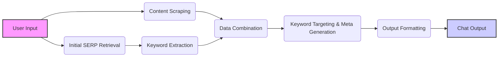

# Week 2 - Meta & Keyword Targeting Agent

## Overview

This tool is designed to quickly generate SEO-optimized titles, meta descriptions and keyword targets for a target page and topic. It leverages AI and various APIs to provide both keyword targets and optimized content.

**Key Features:**

- Uses Google SERPER API to get the top search results for a given topic.
- Scrapes content from a target URL using Firecrawl API.
- Extracts and organizes keywords using DataForSEO API.
- Generates SEO-optimized title tags and meta descriptions.

## How It Works

This LangFlow flow is structured into two parallel flows that converge for final processing:



1.  **User Input:** The process begins with a user providing a target URL and a target topic via the **Chat Input** node.

2.  **Flow 1: Content Scraping:** This flow focuses on extracting and summarizing content from the target URL. It includes:

    - **Prompt (Main Content Scraper Prompt):** Formats a prompt to instruct the agent to scrape the content.
    - **Firecrawl Scrape API Tool:** Uses the Firecrawl API to scrape the content from the target URL.
    - **Agent (Main Content Scraper Agent):** Uses an LLM to scrape the content of the target URL and output it in markdown format.

3.  **Flow 2: Initial SERP and Keyword Analysis:** This flow focuses on identifying relevant search results and keywords. It includes:

    - **Agent (Get SERP Agent):** Uses an LLM to get the top 4 results for the target using the Google SERPER API.
    - **Google Serper API:** Uses the Google SERPER API to search for the given topic and retrieve the top 4 results.
    - **Prompt (Get SERP Prompt):** Formats a prompt to instruct the agent to use the Google SERPER API.
    - **Custom Component (PageKeywordsExtractorTool):** Uses the DataForSEO API to extract keywords for the target URL.
    - **Prompt (Keyword Extraction Prompt):** Formats a prompt to extract and organize keywords from URLs into a markdown table.
    - **Agent (Keyword Extraction Agent):** Uses an LLM to extract and organize keywords from URLs into a markdown table.

4.  **Data Combination:** This step combines the outputs from both flows into a single text chunk. It includes:

    - **Combine Text:** Combines the outputs from the agents and prompts into a single text chunk.

5.  **Keyword Targeting & Meta Generation:** This step focuses on creating SEO-optimized title tags and meta descriptions. It includes:

    - **Prompt (System Prompt):** Formats a prompt to create an SEO-optimized and compelling title tag and meta description for the article.
    - **OpenAI Model (for Title & Meta):** Uses an LLM to generate an SEO-optimized title tag and meta description for the article.

6.  **Output Formatting:** This step cleans up the final output. It includes:
    - **Custom Component (CleanMarkdown):** Uses the textwrap python module to clean the final markdown output.
    - **Chat Output:** Displays the final content outline and H1 heading in a user-friendly format.

## Environment Variables

To use this tool, you need to set the following environment variables in your LangFlow instance:

- **`SERPER_API_KEY`**: Your Serper API key. You can obtain one from the Serper website: [https://serper.dev/](https://serper.dev/)
- **`FIRECRAWL_API_KEY`**: Your Firecrawl API key. You can obtain one from the Firecrawl website: [https://firecrawl.dev/](https://firecrawl.dev/)
- **`OPENAI_API_KEY`**: Your OpenAI API key. You can obtain one from the OpenAI website: [https://platform.openai.com/](https://platform.openai.com/)
- **`DATAFORSEO_USERNAME`**: Your DataForSEO username. You can obtain one from the DataForSEO website: [https://dataforseo.com/](https://dataforseo.com/)
- **`DATAFORSEO_PASSWORD`**: Your DataForSEO password. You can obtain one from the DataForSEO website: [https://dataforseo.com/](https://dataforseo.com/)

**How to Set Environment Variables:**

1.  After uploading the flow to LangFlow, click on the "Settings" icon (usually a gear icon) in the top right corner.
2.  Navigate to the "Environment Variables" section.
3.  Add the required variables with their corresponding values.

## Input Format

The tool expects the following input format:

```
**Page Target**:  [Insert target URL]
**Target Topic**:  [Insert target topic]
```

- **Page Target:** The URL of the page for which you want to generate metadata.
- **Target Topic:** The main topic of the page.

**Example Input:**

```
**Page Target**:  https://www.bankrate.com/investing/types-of-stock/
**Target Topic**:  types of stocks
```

## Output Format

The tool will output a markdown table with the following columns:

| Target Page  | Keyword Targets    | Title Tag                 | Description                      | Reasoning                                      |
| ------------ | ------------------ | ------------------------- | -------------------------------- | ---------------------------------------------- |
| [Target URL] | [List of Keywords] | [SEO-Optimized Title Tag] | [SEO-Optimized Meta Description] | [Reasoning for Title Tag and Meta Description] |

- **Target Page:** The URL of the page that is being targeted.
- **Keyword Targets:** A list of the highest quality keyword targets for the target page, ordered by search volume.
- **Title Tag:** The SEO-optimized title tag for the page.
- **Description:** The SEO-optimized meta description for the page.
- **Reasoning:** The rationale behind the choices for the title tag and meta description.

The output will also include a single H1 heading for the article.

## Usage Tips

- Ensure that your API keys are valid and have sufficient usage credits.
- The tool will take a few minutes to run, depending on the complexity of the topic and the number of URLs it needs to analyze.
- Review the output carefully and make any necessary adjustments to the suggested title tags, meta descriptions, and H1 heading.
- The output is designed to be a starting point for your content optimization process.

## Stay Updated

Follow us to stay updated on the latest AI SEO tools released every Tuesday!

- **Blog:** [https://www.seoworkflows.com/blog](https://www.seoworkflows.com/blog)
- **YouTube:** [https://www.youtube.com/@seoworkflows](https://www.youtube.com/@seoworkflows)
- **LinkedIn:** [https://www.linkedin.com/company/seo-workflows/](https://www.linkedin.com/company/seo-workflows/)

Happy testing! 🚀
