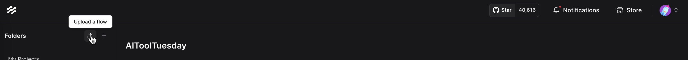

# SEO Workflows - AI Tool Tuesday Repository 🚀

Welcome to the SEO Workflows repository for AI Tool Tuesday! Every Tuesday, we're committed to bringing you a new AI-powered SEO tool to supercharge your workflows. This repository contains the configuration files you need to test these tools using LangFlow.

## What You'll Find Here

This repository is organized by week, with each week's tool residing in its own directory. Inside each directory, you'll find:

- **`week_{num}-{flow_name}.json`**: The LangFlow configuration file for the specific tool.
- **`README.md`**: A detailed guide specific to that tool, including required environment variables and usage instructions.

## Getting Started:

### Setting Up LangFlow

To use these tools, you'll need a LangFlow instance. Here are a couple of options:

- **Datastax (Free Option):** Datastax offers a free way to host your LangFlow instance (as of 12/25/2025). Check it out here: [https://www.datastax.com/products/langflow](https://www.datastax.com/products/langflow)
- **Self-Deployment:** You can also deploy your own LangFlow instance. We recommend using Render.com, and you can find detailed instructions in the LangFlow documentation: [https://docs.langflow.org/deployment-render](https://docs.langflow.org/deployment-render)

### Testing the Tools with LangFlow

Here's how you can quickly get up and running with our AI SEO tools:

1.  **Download the Flow:** Navigate to the directory of the tool you want to test and download the `week_{num}-{flow_name}.json` file.
2.  **Log in to LangFlow:** Access your LangFlow instance. If you don't have one yet, see the "Setting Up LangFlow" section below.
3.  **Upload the Flow:** In LangFlow, click the "Upload a flow" button.
    
4.  **Open the Flow:** Select the downloaded `.json` file to import the tool's configuration.
5.  **Configure Environment Variables:**
    - **Crucial Step:** Each tool requires specific environment variables (like API keys).
    - **Find Instructions:** Refer to the `README.md` file within the tool's directory for detailed instructions on which variables to update.
6.  **Test the Tool:** Once the environment variables are set, you're ready to test the AI tool!

## Stay Updated

Follow us to stay updated on the latest AI SEO tools released every Tuesday!

- **Blog:** [https://www.seoworkflows.com/blog](https://www.seoworkflows.com/blog)
- **YouTube:** [https://www.youtube.com/@seoworkflows](https://www.youtube.com/@seoworkflows)
- **LinkedIn:** [https://www.linkedin.com/company/seo-workflows/](https://www.linkedin.com/company/seo-workflows/)

Happy testing! 🚀
